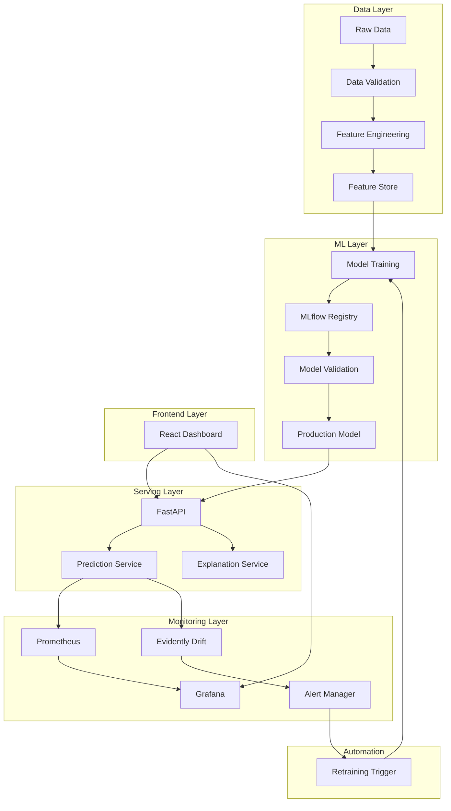

# 🚀 Intelligent Supply Chain System with MLOps

> **Production-Grade ML System for Demand Forecasting & Anomaly Detection**


---

## 📋 Table of Contents

1. [Project Overview](#-project-overview)
2. [Tech Stack](#-tech-stack)
3. [Architecture](#-architecture)
4. [Implementation Phases](#-implementation-phases)
5. [Project Structure](#-project-structure)
6. [Quick Start](#-quick-start)
7. [Detailed Roadmap](#-detailed-roadmap)
8. [Deliverables](#-deliverables)
9. [Success Metrics](#-success-metrics)

---

## 🎯 Project Overview

### Problem Statement
Build a production-grade machine learning system for **demand forecasting** and **anomaly detection** in supply chain operations, with full MLOps capabilities for model lifecycle management.

### Key Objectives
- **Accurate Demand Forecasting**: Predict sales with low RMSE and MAPE
- **Anomaly Detection**: Automatically identify unusual patterns in sales data
- **Production-Ready API**: FastAPI-based REST endpoints with authentication
- **Full MLOps Pipeline**: Automated training, versioning, monitoring, and deployment
- **Real-Time Monitoring**: Drift detection, performance tracking, and alerting
- **Modern Frontend**: React-based dashboard for predictions and insights

### Key Differentiators from Traditional Projects
| Traditional Approach | This MLOps Approach |
|---------------------|---------------------|
| Streamlit/Jupyter PoC | Production React/FastAPI |
| Manual model training | Automated retraining pipelines |
| No versioning | MLflow model registry |
| No monitoring | Evidently + Prometheus + Grafana |
| Manual deployment | CI/CD with Kubernetes |
| No data validation | Great Expectations pipelines |

---

## 🛠 Tech Stack

### Core ML & Data
| Component | Technology | Purpose |
|-----------|------------|---------|
| ML Framework | XGBoost, scikit-learn | Forecasting & anomaly detection |
| Feature Store | SQLite/PostgreSQL | Feature versioning & serving |
| Data Validation | Great Expectations | Data quality checks |
| Experiment Tracking | MLflow | Model versioning & registry |
| Drift Detection | Evidently AI | Data & model drift monitoring |

### Backend & API
| Component | Technology | Purpose |
|-----------|------------|---------|
| API Framework | FastAPI | REST endpoints |
| Authentication | OAuth2/JWT | Secure access |
| Database | PostgreSQL | Predictions & metadata storage |
| Caching | Redis | Performance optimization |
| Task Queue | APScheduler | Scheduled jobs |

### Frontend
| Component | Technology | Purpose |
|-----------|------------|---------|
| Framework | React 18 | Web dashboard |
| UI Library | Material-UI | Component styling |
| Charts | Recharts | Data visualization |
| State Management | React Query | Data fetching & caching |

### Infrastructure & DevOps
| Component | Technology | Purpose |
|-----------|------------|---------|
| Containerization | Docker | Application packaging |
| Orchestration | Kubernetes | Container orchestration |
| CI/CD | GitHub Actions | Automated pipelines |
| Monitoring | Prometheus + Grafana | Metrics & dashboards |
| Logging | ELK Stack | Centralized logging |
| Tracing | Jaeger | Distributed tracing |

---

## 🏗 Architecture



---

## 📅 Implementation Phases

### Phase Overview

| Phase | Name | Duration | Priority |
|-------|------|----------|----------|
| 0 | Foundation Setup | 1 day | 🔴 Critical |
| I | Configuration Management | 0.5 day | 🔴 Critical |
| II | Data Versioning & Validation | 2 days | 🔴 Critical |
| III | MLflow Integration | 1 day | 🔴 Critical |
| IV | Feature Engineering | 2 days | 🔴 Critical |
| V | Model Training | 2 days | 🔴 Critical |
| VI | Model Validation & Testing | 1 day | 🟡 High |
| VII | Model Serving API | 2 days | 🔴 Critical |
| VIII | Monitoring & Observability | 2 days | 🟡 High |
| IX | Automated Retraining | 1 day | 🟡 High |
| X | CI/CD Pipeline | 1 day | 🟡 High |
| XI | Kubernetes Deployment | 2 days | 🟢 Medium |
| XII | Observability Stack | 1 day | 🟢 Medium |
| XIII | Frontend Application | 3 days | 🟡 High |
| XIV | Load Testing & Optimization | 1 day | 🟢 Medium |
| XV | Security & Compliance | 1 day | 🟡 High |
| XVI | Documentation | 1 day | 🟢 Medium |
| XVII | Production Readiness | 1 day | 🔴 Critical |
| XVIII | Future Enhancements | Ongoing | 🔵 Optional |

**Estimated Total: ~25 days (5 weeks)**

---

## 📁 Project Structure

```
supply-chain-mlops/
├── 📂 config/
│   ├── config.yaml              # Main configuration
│   ├── logging_config.yaml      # Logging settings
│   └── secrets.yaml.example     # Secrets template
│
├── 📂 data/
│   ├── raw/                     # Original data (DVC tracked)
│   ├── processed/               # Cleaned data
│   └── validation/              # Validation reports
│
├── 📂 src/
│   ├── 📂 api/
│   │   ├── main.py              # FastAPI app
│   │   ├── schemas.py           # Pydantic models
│   │   ├── model_service.py     # Model loading
│   │   ├── feature_service.py   # Feature generation
│   │   ├── predictor.py         # Prediction logic
│   │   ├── monitoring.py        # Metrics endpoints
│   │   └── auth.py              # Authentication
│   │
│   ├── 📂 data/
│   │   ├── generate_data.py     # Synthetic data generation
│   │   ├── data_validation.py   # Great Expectations
│   │   └── preprocessing.py     # Data cleaning
│   │
│   ├── 📂 features/
│   │   ├── feature_engineering.py
│   │   └── feature_store.py
│   │
│   ├── 📂 models/
│   │   ├── train.py             # Training logic
│   │   ├── hyperparameter_tuning.py
│   │   ├── model_registry.py    # MLflow registry
│   │   ├── experiment_manager.py
│   │   └── retraining_triggers.py
│   │
│   ├── 📂 monitoring/
│   │   ├── drift_detection.py   # Evidently
│   │   ├── performance_monitoring.py
│   │   ├── prediction_logger.py
│   │   ├── dashboard_api.py
│   │   └── alerting.py
│   │
│   └── config.py                # Config loader
│
├── 📂 pipelines/
│   ├── feature_pipeline.py
│   ├── training_pipeline.py
│   ├── automated_retraining.py
│   └── scheduler.py
│
├── 📂 tests/
│   ├── unit/
│   ├── integration/
│   └── e2e/
│
├── 📂 infrastructure/
│   ├── 📂 docker/
│   │   ├── Dockerfile.api
│   │   ├── Dockerfile.monitoring
│   │   ├── Dockerfile.mlflow
│   │   └── Dockerfile.frontend
│   ├── 📂 kubernetes/
│   │   ├── namespace.yaml
│   │   ├── api-deployment.yaml
│   │   ├── api-service.yaml
│   │   ├── hpa.yaml
│   │   └── ingress.yaml
│   └── docker-compose.yml
│
├── 📂 frontend/
│   └── ml-dashboard/            # React application
│
├── 📂 monitoring/
│   ├── prometheus/
│   └── grafana/
│
├── 📂 mlruns/                   # MLflow artifacts
│
├── 📂 models/
│   ├── registry/
│   ├── staging/
│   └── production/
│
├── 📂 docs/
│   ├── architecture.md
│   ├── api-reference.md
│   ├── model-documentation.md
│   ├── runbooks/
│   └── user-guide/
│
├── 📂 .github/
│   └── workflows/
│       ├── ci.yml
│       ├── cd-staging.yml
│       └── cd-production.yml
│
├── .gitignore
├── .dvc/                        # DVC configuration
├── requirements.txt
├── pytest.ini
└── README.md
```

---

## ⚡ Quick Start

### Prerequisites
- Python 3.9+
- Docker & Docker Compose
- Node.js 18+ (for frontend)
- kubectl (for Kubernetes deployment)

### Local Development Setup

```bash
# 1. Clone and setup
git clone <repository-url>
cd supply-chain-mlops

# 2. Create virtual environment
python -m venv venv
source venv/bin/activate  # or `venv\Scripts\activate` on Windows

# 3. Install dependencies
pip install -r requirements.txt

# 4. Initialize DVC
dvc init
dvc remote add -d local_storage ./dvc_storage

# 5. Generate sample data
python src/data/generate_data.py

# 6. Start MLflow server
mlflow server --backend-store-uri sqlite:///mlflow.db --default-artifact-root ./mlruns --port 5000

# 7. Run training pipeline
python pipelines/training_pipeline.py

# 8. Start API
uvicorn src.api.main:app --reload --port 8000

# 9. Start frontend (in separate terminal)
cd frontend/ml-dashboard && npm start
```

### Docker Compose (Full Stack)

```bash
docker-compose up -d
```

This starts:
- FastAPI (port 8000)
- MLflow (port 5000)
- Prometheus (port 9090)
- Grafana (port 3000)
- Frontend (port 80)

---

## 📖 Detailed Roadmap

### PHASE 0: Foundation Setup (Day 1)

#### Step 0.1: Environment Preparation
- [ ] Create `supply-chain-mlops` project folder
- [ ] Initialize Python virtual environment
- [ ] Create `requirements.txt` with all dependencies:
  ```
  # Core ML
  pandas>=2.0.0
  numpy>=1.24.0
  scikit-learn>=1.3.0
  xgboost>=2.0.0
  optuna>=3.4.0
  shap>=0.43.0
  
  # API
  fastapi>=0.104.0
  uvicorn[standard]>=0.24.0
  pydantic>=2.5.0
  python-jose[cryptography]>=3.3.0
  passlib[bcrypt]>=1.7.4
  
  # MLOps
  mlflow>=2.9.0
  evidently>=0.4.0
  great-expectations>=0.18.0
  dvc>=3.30.0
  
  # Database
  sqlalchemy>=2.0.0
  alembic>=1.12.0
  psycopg2-binary>=2.9.0
  redis>=5.0.0
  
  # Monitoring
  prometheus-client>=0.19.0
  
  # Testing
  pytest>=7.4.0
  pytest-cov>=4.1.0
  pytest-asyncio>=0.21.0
  httpx>=0.25.0
  locust>=2.19.0
  
  # Utilities
  pyyaml>=6.0.0
  python-dotenv>=1.0.0
  loguru>=0.7.0
  ```
- [ ] Install dependencies
- [ ] Initialize git repository
- [ ] Create comprehensive `.gitignore`

#### Step 0.2: Directory Structure
- [ ] Create all folders as per project structure
- [ ] Verify structure with `tree` command
- [ ] Add placeholder `__init__.py` files

---

### PHASE I: Configuration Management (Day 1-2)

#### Step 1.1: Configuration Files
- [ ] Create `config/config.yaml`:
  ```yaml
  project:
    name: "supply-chain-mlops"
    version: "1.0.0"
  
  data:
    raw_path: "data/raw"
    processed_path: "data/processed"
    start_date: "2022-01-01"
    end_date: "2024-12-31"
    stores: 10
    items: 50
  
  features:
    lag_windows: [7, 14, 28]
    rolling_windows: [7, 30]
    date_features: ["year", "month", "day", "day_of_week", "is_weekend"]
  
  model:
    type: "xgboost"
    hyperparameters:
      n_estimators: 100
      max_depth: 6
      learning_rate: 0.1
      subsample: 0.8
    tuning:
      n_trials: 50
      metric: "rmse"
  
  api:
    host: "0.0.0.0"
    port: 8000
    workers: 4
    rate_limit: 100
  
  mlflow:
    tracking_uri: "http://localhost:5000"
    experiment_name: "supply-chain-forecast"
  
  monitoring:
    drift_threshold: 0.05
    performance_degradation_threshold: 0.1
    alert_email: "alerts@company.com"
  ```

#### Step 1.2: Configuration Loader
- [ ] Create `src/config.py` with Pydantic models
- [ ] Add validation for all configuration sections
- [ ] Implement environment variable overrides
- [ ] Add secrets loading with fallback

---

### PHASE II: Data Versioning & Validation (Days 2-4)

#### Step 2.1: DVC Setup
- [ ] Initialize DVC: `dvc init`
- [ ] Configure remote storage
- [ ] Create `.dvc/config`

#### Step 2.2: Synthetic Data Generation
- [ ] Create `src/data/generate_data.py`
- [ ] Generate sales data with:
  - Seasonal patterns (weekly, monthly, yearly)
  - Trend components
  - Random noise
  - Store-item combinations
  - Intentional anomalies (5%)
- [ ] Generate calendar data with holidays
- [ ] Create data metadata JSON
- [ ] Track with DVC

#### Step 2.3: Data Validation
- [ ] Create `src/data/data_validation.py`
- [ ] Define Great Expectations suite:
  - No null values in critical columns
  - Sales values >= 0
  - Valid date ranges
  - Unique identifiers
  - Data type validations
- [ ] Generate HTML validation reports

#### Step 2.4: Data Preprocessing
- [ ] Create `src/data/preprocessing.py`
- [ ] Implement `DataPreprocessor` class:
  - Missing value handling
  - Outlier detection (IQR method)
  - Date parsing
  - Dataset merging
  - Save to Parquet format
- [ ] Add comprehensive logging

---

### PHASE III: MLflow Integration (Day 5)

#### Step 3.1: MLflow Server Setup
- [ ] Create `mlflow_setup.sh` script
- [ ] Configure SQLite backend
- [ ] Test MLflow UI access

#### Step 3.2: Experiment Manager
- [ ] Create `src/models/experiment_manager.py`
- [ ] Implement `ExperimentManager` class:
  - Experiment creation
  - Run management
  - Parameter logging
  - Metric logging
  - Artifact logging

---

### PHASE IV: Feature Engineering (Days 6-7)

#### Step 4.1: Feature Engineering Module
- [ ] Create `src/features/feature_engineering.py`
- [ ] Implement features:
  - Date features (year, month, day, day_of_week, is_weekend)
  - Cyclical encoding (sin/cos for month, day_of_week)
  - Lag features (7, 14, 28 days)
  - Rolling statistics (mean, std for 7, 30 days)
  - Categorical encoding (one-hot or target)
- [ ] Implement time-based train/val/test split
- [ ] Log all feature engineering steps to MLflow

#### Step 4.2: Feature Store
- [ ] Create `src/features/feature_store.py`
- [ ] Implement versioned feature storage
- [ ] Add metadata tracking
- [ ] Create retrieval functions

#### Step 4.3: Feature Pipeline
- [ ] Create `pipelines/feature_pipeline.py`
- [ ] Orchestrate all feature engineering steps
- [ ] Add validation and error handling

---

### PHASE V: Model Training (Days 8-9)

#### Step 5.1: Training Module
- [ ] Create `src/models/train.py`
- [ ] Implement `ModelTrainer` class:
  - Data loading from feature store
  - XGBoost model training
  - Evaluation (RMSE, MAPE, MAE, R²)
  - Residual analysis
  - Feature importance

#### Step 5.2: Hyperparameter Tuning
- [ ] Create `src/models/hyperparameter_tuning.py`
- [ ] Implement Optuna optimization
- [ ] Log all trials to MLflow
- [ ] Return best parameters

#### Step 5.3: Anomaly Detection
- [ ] Add `AnomalyTrainer` class:
  - Residual-based detection
  - Isolation Forest
  - Ensemble methods
- [ ] Evaluate with precision, recall, F1

#### Step 5.4: Model Registry
- [ ] Create `src/models/model_registry.py`
- [ ] Implement model registration
- [ ] Stage transitions (Staging → Production)
- [ ] Version comparison

#### Step 5.5: Training Pipeline
- [ ] Create `pipelines/training_pipeline.py`
- [ ] Full orchestration with error handling
- [ ] Model card generation

---

### PHASE VI: Model Testing (Day 10)

#### Step 6.1: Unit Tests
- [ ] Test model initialization
- [ ] Test prediction shape and range
- [ ] Test feature importance

#### Step 6.2: Data Quality Tests
- [ ] Test preprocessing output
- [ ] Test feature engineering output

#### Step 6.3: Integration Tests
- [ ] End-to-end pipeline test
- [ ] Model registry workflow test

#### Step 6.4: Performance Tests
- [ ] Inference latency tests
- [ ] Accuracy threshold tests

---

### PHASE VII: Model Serving API (Days 11-12)

#### Step 7.1: Core API Setup
- [ ] Create `src/api/main.py`
- [ ] Configure FastAPI with metadata
- [ ] Add CORS and Prometheus middlewares

#### Step 7.2: API Schemas
- [ ] Create Pydantic models for:
  - `HealthCheck`
  - `PredictionRequest/Response`
  - `BatchPredictionRequest/Response`
  - `ModelInfo`

#### Step 7.3: Services
- [ ] `ModelService` - Model loading and caching
- [ ] `FeatureService` - Online feature generation
- [ ] `Predictor` - Prediction logic with SHAP

#### Step 7.4: Endpoints
- [ ] `GET /health` - Health check
- [ ] `POST /predict` - Single prediction
- [ ] `POST /predict/batch` - Batch predictions
- [ ] `GET /models/info` - Model metadata
- [ ] `POST /explain` - SHAP explanations
- [ ] `POST /admin/reload` - Model reload (authenticated)

#### Step 7.5: Security
- [ ] API key authentication
- [ ] Rate limiting
- [ ] Input validation

---

### PHASE VIII: Monitoring (Days 13-14)

#### Step 8.1: Drift Detection
- [ ] Implement Evidently integration
- [ ] Data drift detection (KS test, Chi-squared)
- [ ] Generate drift reports

#### Step 8.2: Performance Monitoring
- [ ] Rolling metric calculation
- [ ] Degradation detection
- [ ] Performance reports

#### Step 8.3: Prediction Logging
- [ ] Database schema for predictions
- [ ] Logging integration
- [ ] Query API

#### Step 8.4: Alerting
- [ ] Define alert rules
- [ ] Email/Slack notifications
- [ ] Alert manager integration

---

### PHASE IX: Automated Retraining (Day 15)

#### Step 9.1: Retraining Triggers
- [ ] Time-based triggers
- [ ] Performance-based triggers
- [ ] Drift-based triggers
- [ ] Data volume triggers

#### Step 9.2: Retraining Pipeline
- [ ] Automated data fetch
- [ ] Validation and training
- [ ] Model comparison
- [ ] Staging promotion
- [ ] Rollback mechanism

#### Step 9.3: Scheduling
- [ ] Configure APScheduler
- [ ] Daily trigger checks
- [ ] Weekly full retraining
- [ ] Hourly monitoring

---

### PHASE X: CI/CD (Day 16)

#### Step 10.1: GitHub Actions
- [ ] CI workflow (lint, test, coverage)
- [ ] Staging deployment workflow
- [ ] Production deployment workflow

#### Step 10.2: Deployment Scripts
- [ ] Docker build scripts
- [ ] Kubernetes deployment scripts
- [ ] Rollback scripts

---

### PHASE XI: Kubernetes (Days 17-18)

#### Step 11.1: Dockerfiles
- [ ] API Dockerfile
- [ ] Monitoring Dockerfile
- [ ] MLflow Dockerfile
- [ ] Frontend Dockerfile
- [ ] docker-compose.yml

#### Step 11.2: Kubernetes Manifests
- [ ] Namespace
- [ ] Deployments (API, monitoring, MLflow)
- [ ] Services
- [ ] HPA (autoscaling)
- [ ] Ingress

---

### PHASE XII: Observability Stack (Day 19)

#### Step 12.1: Prometheus
- [ ] Configuration
- [ ] Alert rules
- [ ] Deployment

#### Step 12.2: Grafana
- [ ] API performance dashboard
- [ ] Model performance dashboard
- [ ] Data drift dashboard

#### Step 12.3: Logging & Tracing
- [ ] ELK stack or cloud logging
- [ ] Jaeger integration

---

### PHASE XIII: Frontend (Days 20-22)

#### Step 13.1: React Setup
- [ ] Create React app
- [ ] Install dependencies (MUI, Recharts, React Query)
- [ ] Project structure

#### Step 13.2: Components
- [ ] Layout (TopBar, Sidebar)
- [ ] PredictionForm
- [ ] PredictionResults
- [ ] HistoricalChart
- [ ] ShapExplanation

#### Step 13.3: Dashboards
- [ ] Prediction page
- [ ] Anomaly dashboard
- [ ] Model performance dashboard
- [ ] Data drift dashboard

#### Step 13.4: Polish
- [ ] Authentication
- [ ] Error handling
- [ ] Production build
- [ ] Deployment

---

### PHASE XIV: Load Testing (Day 23)

- [ ] Locust test scenarios
- [ ] Performance analysis
- [ ] Caching implementation (Redis)
- [ ] Optimization (batch processing, ONNX)
- [ ] Database optimization

---

### PHASE XV: Security (Day 24)

- [ ] Security headers
- [ ] Input sanitization
- [ ] Secrets management
- [ ] RBAC implementation
- [ ] Model governance
- [ ] Data privacy (GDPR)

---

### PHASE XVI: Documentation (Day 25)

- [ ] Technical documentation
- [ ] API reference
- [ ] Model documentation
- [ ] Operational runbooks
- [ ] User guides
- [ ] README

---

### PHASE XVII: Production Readiness (Day 26)

- [ ] End-to-end system test
- [ ] Disaster recovery testing
- [ ] Performance benchmarking
- [ ] Security audit
- [ ] Production checklist
- [ ] Staging to production migration

---

### PHASE XVIII: Future Enhancements (Ongoing)

- [ ] A/B testing framework
- [ ] Multi-armed bandit
- [ ] Feature flags
- [ ] Explainability dashboard
- [ ] MLOps metrics dashboard

---

## 📦 Deliverables

### 1. Production ML System
- Fully functional forecasting + anomaly detection
- Running on Kubernetes with auto-scaling
- 99.9% uptime SLA

### 2. MLOps Platform
- Experiment tracking (MLflow)
- Model registry with versioning
- Automated retraining pipelines
- Drift detection and alerting

### 3. Web Dashboard
- React-based prediction interface
- Real-time monitoring dashboards
- SHAP explanation visualizations

### 4. API Service
- FastAPI with authentication
- <200ms p95 latency
- 100+ requests/second throughput

### 5. Infrastructure
- Docker containers
- Kubernetes manifests
- CI/CD pipelines
- Monitoring stack

### 6. Documentation
- Architecture docs
- API reference
- Runbooks
- User guides

---

## 📊 Success Metrics

### Model Performance
| Metric | Target | Measurement |
|--------|--------|-------------|
| Forecast RMSE | < 15% of mean | Weekly evaluation |
| Forecast MAPE | < 10% | Weekly evaluation |
| Anomaly F1 Score | > 0.85 | Monthly evaluation |

### System Performance
| Metric | Target | Measurement |
|--------|--------|-------------|
| API Latency (p95) | < 200ms | Continuous |
| API Throughput | > 100 req/s | Load testing |
| Uptime | > 99.9% | Monthly |

### MLOps Metrics
| Metric | Target | Measurement |
|--------|--------|-------------|
| Model Deployment Frequency | Weekly | Tracking |
| Mean Time to Recovery | < 1 hour | Incident tracking |
| Test Coverage | > 80% | CI pipeline |
| Drift Detection Lag | < 24 hours | Monitoring |

---

## ✅ Production Checklist

### Infrastructure
- [ ] Kubernetes cluster deployed
- [ ] All services healthy
- [ ] Auto-scaling configured
- [ ] SSL certificates installed

### Code Quality
- [ ] All tests passing
- [ ] Coverage > 80%
- [ ] Security vulnerabilities addressed

### MLOps
- [ ] MLflow operational
- [ ] Model registry populated
- [ ] Automated training working
- [ ] A/B testing functional

### Monitoring
- [ ] Prometheus collecting metrics
- [ ] Grafana dashboards created
- [ ] Alerts configured and tested
- [ ] Logging centralized

### Documentation
- [ ] Technical docs complete
- [ ] API docs generated
- [ ] Runbooks written
- [ ] README comprehensive

---

## 📝 Notes & Recommendations

### Improvements Made to Original Plan

1. **Added Success Metrics**: Clear, measurable KPIs for model and system performance
2. **Structured Dependencies**: Clearer phase dependencies and prerequisites
3. **Realistic Timeline**: ~25 days (5 weeks) instead of undefined duration
4. **Quick Start Guide**: Immediate actionable steps to get started
5. **Visual Architecture**: Mermaid diagram for system understanding
6. **Checklist Format**: Easy-to-track progress with checkboxes
7. **Tech Stack Clarity**: Tables with clear technology-purpose mapping

### Optional Enhancements (Post-MVP)
- **Federated Learning**: For distributed training across stores
- **Real-time Streaming**: Apache Kafka for live predictions
- **AutoML Integration**: For automated model selection
- **Cost Optimization**: Spot instances, model compression

---

## 📞 Contact & Support

- **Project Owner**: [Your Name]
- **Repository**: [GitHub URL]
- **Documentation**: [Docs URL]
- **Issue Tracker**: [Issues URL]

---

*Last Updated: January 2, 2026*
